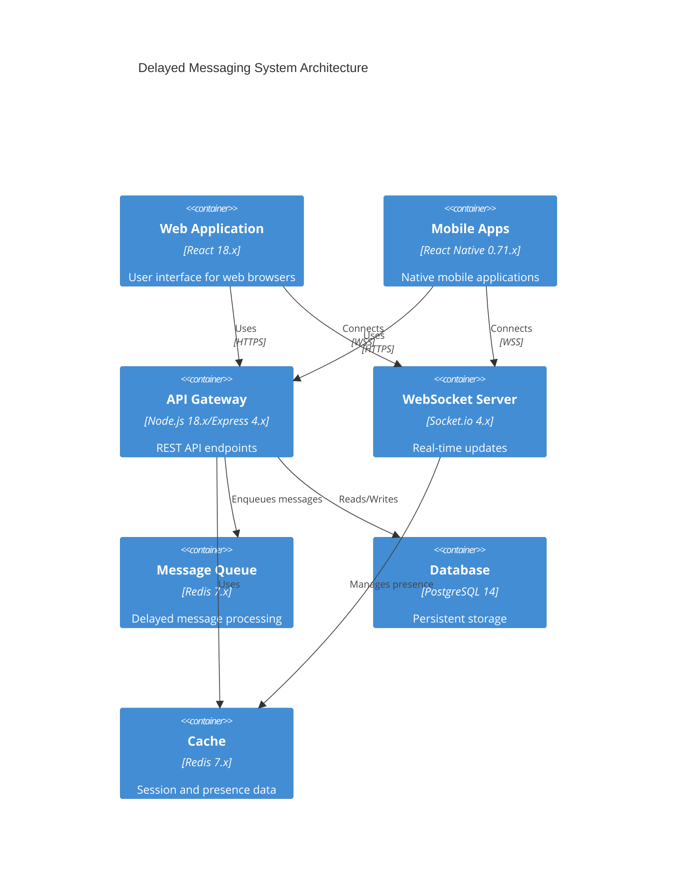
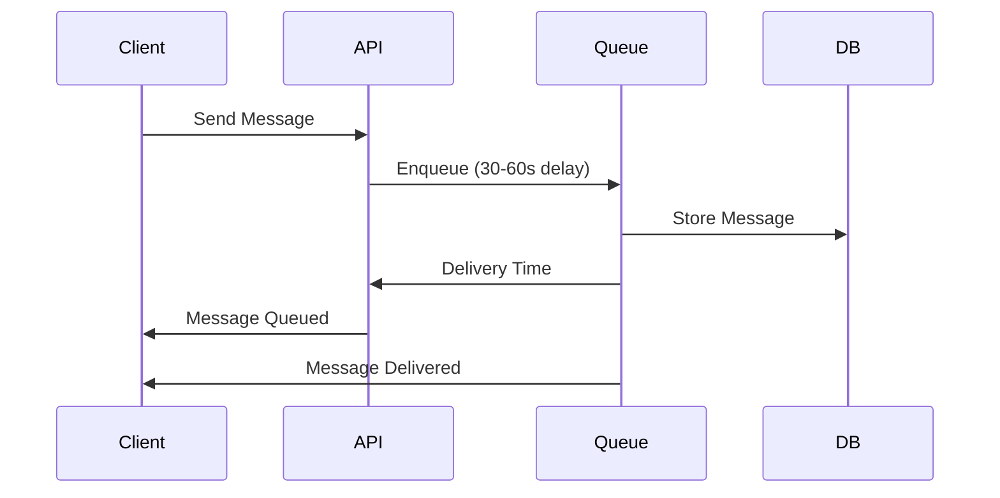
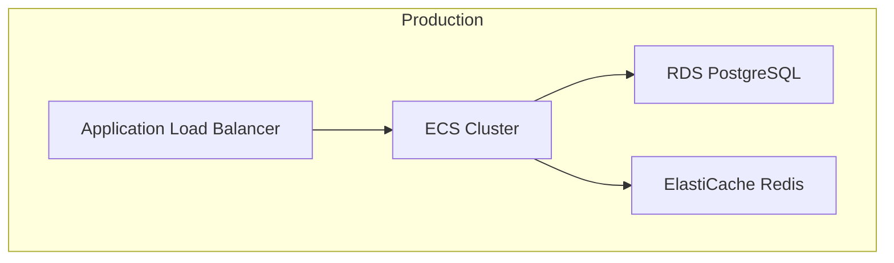
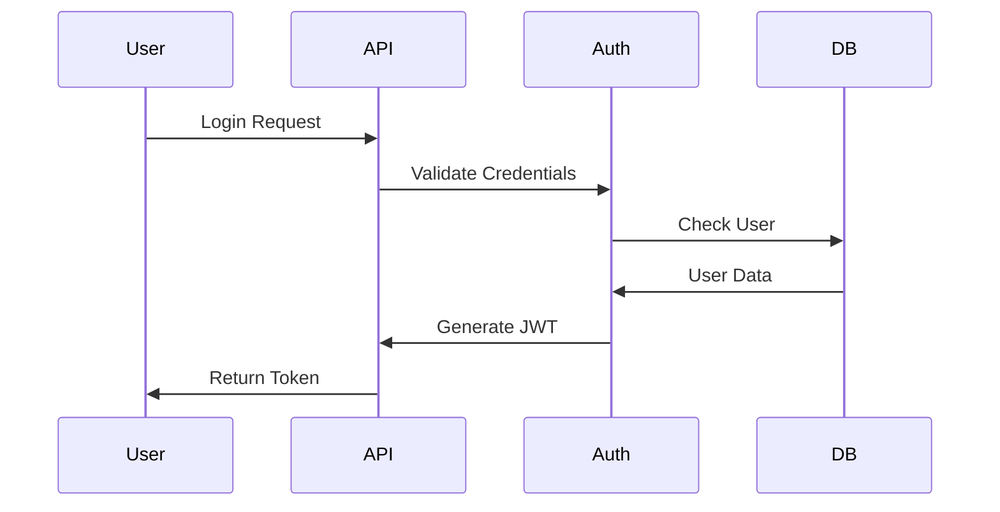

# Delayed Messaging System

[](https://github.com/username/delayed-messaging/actions)
[](https://codecov.io/gh/username/delayed-messaging)
[](https://opensource.org/licenses/MIT)
[](https://snyk.io/test/github/username/delayed-messaging)

A specialized communication platform designed to introduce intentional delays between message sending and delivery, promoting mindful digital communication through mandatory 30-60 second delivery delays.

## System Overview



### Core Features
- Mandatory 30-60 second message delivery delay
- Real-time delivery status tracking
- User presence monitoring
- Secure message storage and transmission
- Cross-platform support (Web, iOS, Android)

## Getting Started

### System Requirements
- Node.js 18.x LTS
- Docker 20.x
- Docker Compose 2.x
- 4GB RAM minimum
- 20GB storage minimum
- 2 CPU cores minimum

Supported Operating Systems:
- Ubuntu 20.04+
- macOS 12+
- Windows 10/11 with WSL2

### Development Environment Setup

1. Clone the repository:
```bash
git clone https://github.com/username/delayed-messaging.git
cd delayed-messaging
```

2. Install dependencies:
```bash
npm install
```

3. Configure environment variables:
```bash
cp .env.example .env
# Edit .env with your configuration
```

4. Start development environment:
```bash
docker-compose up -d
```

5. Initialize database:
```bash
npm run db:migrate
npm run db:seed
```

6. Start development server:
```bash
npm run dev
```

### Running Tests
```bash
# Unit tests
npm run test

# Integration tests
npm run test:integration

# E2E tests
npm run test:e2e

# Coverage report
npm run test:coverage
```

## Architecture

### Component Details

| Component | Technology | Purpose |
|-----------|------------|----------|
| API Gateway | Node.js 18.x/Express 4.x | Request handling and routing |
| Message Queue | Redis 7.x | Delay management |
| Database | PostgreSQL 14 | Persistent storage |
| WebSocket Server | Socket.io 4.x | Real-time updates |
| Cache Layer | Redis 7.x | Session/presence management |

### Message Flow



## Deployment

### AWS Infrastructure Setup



### Environment Configuration

| Environment | Purpose | Infrastructure |
|-------------|---------|----------------|
| Development | Local development | Docker Compose |
| Testing | Automated testing | AWS ECS Single Instance |
| Staging | Pre-production | AWS ECS Cluster (Single AZ) |
| Production | Live system | AWS ECS Cluster (Multi-AZ) |

## Security

### Authentication Flow



### Security Measures
- TLS 1.3 for all communications
- AES-256 message encryption
- JWT-based authentication
- Rate limiting (100 requests/minute)
- AWS WAF protection
- Regular security audits

## Contributing

Please read [CONTRIBUTING.md](CONTRIBUTING.md) for details on our code of conduct, development process, and pull request guidelines.

## License

This project is licensed under the MIT License - see the [LICENSE](LICENSE) file for details.

## Support

For support and questions:
- Create an issue in the GitHub repository
- Contact the development team at support@example.com
- Join our Slack community

## Acknowledgments

- Redis Labs for message queue implementation guidance
- PostgreSQL community for database optimization tips
- AWS for infrastructure best practices