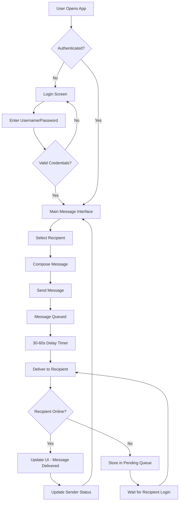
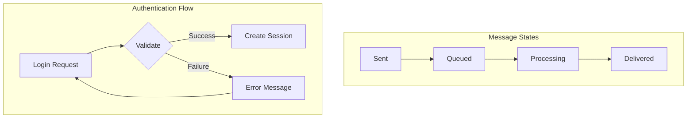
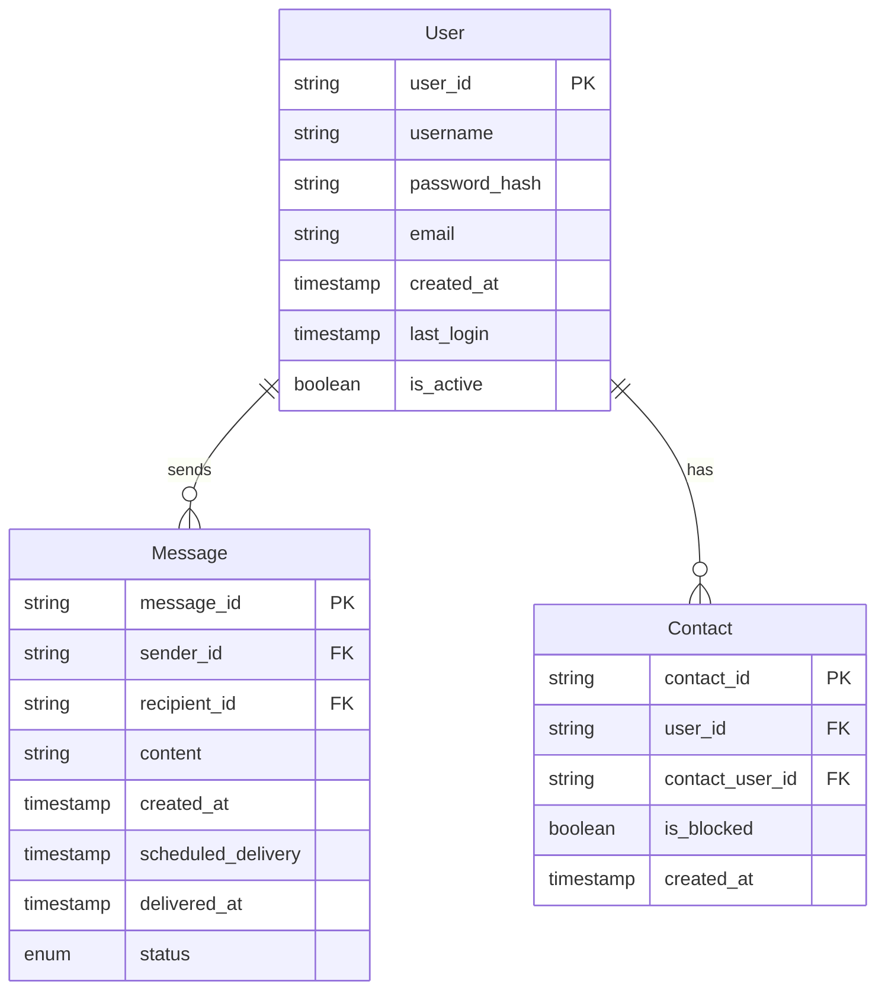
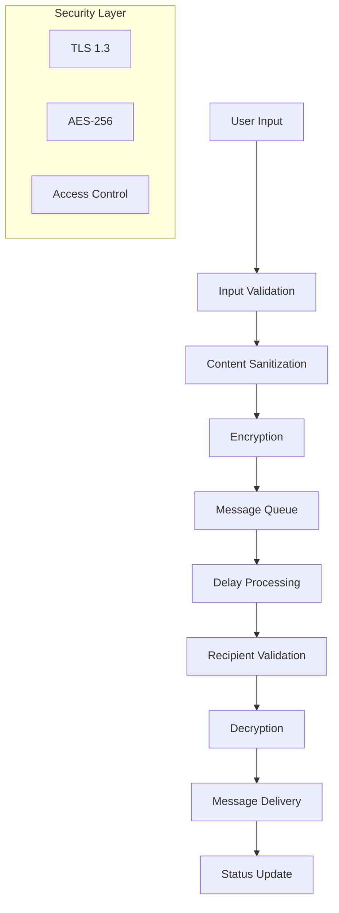

# Product Requirements Document (PRD)

# 1. INTRODUCTION

## 1.1 Purpose
This Product Requirements Document (PRD) outlines the comprehensive requirements for developing a delayed messaging application. The document serves as a reference for:
- Development team members implementing the system
- Quality assurance engineers testing the application
- Project managers overseeing development progress
- Stakeholders reviewing technical specifications

## 1.2 Scope
The delayed messaging application is a communication platform that introduces an intentional delay between message sending and delivery. The system will:

- Provide secure user authentication through username/password login
- Enable users to send text messages to other registered users
- Implement a mandatory 30-60 second delay between message transmission and delivery
- Display message status (sent, pending, delivered) to users
- Manage message queuing and scheduled delivery
- Support real-time user presence and availability

Key benefits include:
- Reduced pressure for immediate responses
- Enhanced message anticipation
- Unique user experience differentiating from instant messaging
- Potential reduction in messaging anxiety

Out of scope:
- Voice or video messaging
- File attachments
- Group messaging
- Message editing after sending
- Message recall functionality

# 2. PRODUCT DESCRIPTION

## 2.1 Product Perspective
The delayed messaging application operates as a standalone mobile and web application within the broader messaging ecosystem. While most messaging platforms focus on instant delivery, this application intentionally introduces delays to create a unique communication experience. The system interfaces with:

- User authentication services for secure login
- Message queuing system for delayed delivery
- Real-time status tracking infrastructure
- User presence monitoring service

## 2.2 Product Functions
The core functions of the delayed messaging system include:

- User Registration and Authentication
  - Account creation with username/password
  - Secure login/logout functionality
  - Session management

- Message Management
  - Composition and sending of text messages
  - Queuing system for delayed delivery (30-60 seconds)
  - Message status tracking (sent, pending, delivered)
  - Message history and conversation view

- User Interface
  - Contact list management
  - Real-time user presence indicators
  - Message composition interface
  - Delivery status notifications

## 2.3 User Characteristics
Target users include:

1. Primary Users (Age 18-35)
   - Digitally native individuals
   - Regular users of messaging applications
   - Seeking mindful communication alternatives
   - Comfortable with technology
   - Value unique social experiences

2. Secondary Users (Age 35+)
   - Professional communicators
   - Users seeking reduced communication pressure
   - Various levels of technical proficiency
   - Interested in alternative messaging paradigms

## 2.4 Constraints
Technical Constraints:
- Maximum message length of 1000 characters
- Delivery delay fixed between 30-60 seconds
- Text-only message format
- Single recipient per message
- Internet connectivity required
- Mobile devices must support minimum OS versions:
  - iOS 13.0 or later
  - Android 8.0 or later

Resource Constraints:
- Initial deployment limited to 10,000 concurrent users
- Message storage limited to 30 days
- Maximum 1000 contacts per user

## 2.5 Assumptions and Dependencies
Assumptions:
- Users have consistent internet access
- Target audience accepts delayed message delivery
- Basic smartphone literacy among users
- Users understand English interface

Dependencies:
- Cloud hosting service availability
- Third-party authentication service reliability
- Mobile platform app store approvals
- Message queuing system performance
- Database scaling capabilities
- Network latency within acceptable ranges

# 3. PROCESS FLOWCHART





# 4. FUNCTIONAL REQUIREMENTS

## 4.1 User Authentication (F1)

### Description
Secure user registration and authentication system allowing users to create accounts and access the application.

### Priority
High

### Requirements

| ID | Requirement | Details |
|----|------------|---------|
| F1.1 | User Registration | Users must provide username, password, and email for account creation |
| F1.2 | Password Security | Passwords must be at least 8 characters with 1 uppercase, 1 lowercase, 1 number |
| F1.3 | Login System | Username/password authentication with session management |
| F1.4 | Session Handling | Auto-logout after 24 hours of inactivity |
| F1.5 | Password Recovery | Email-based password reset functionality |

## 4.2 Message Composition (F2)

### Description
Interface and functionality for users to compose and send text messages.

### Priority
High

### Requirements

| ID | Requirement | Details |
|----|------------|---------|
| F2.1 | Text Input | Support for up to 1000 characters per message |
| F2.2 | Recipient Selection | Single recipient selection from contact list |
| F2.3 | Character Counter | Real-time display of remaining characters |
| F2.4 | Send Button | Clearly visible send action with confirmation |
| F2.5 | Input Validation | Prevent empty messages and invalid recipients |

## 4.3 Message Delivery System (F3)

### Description
Core delayed delivery mechanism managing message queue and timing.

### Priority
High

### Requirements

| ID | Requirement | Details |
|----|------------|---------|
| F3.1 | Delay Timer | Random delay between 30-60 seconds for each message |
| F3.2 | Message Queue | FIFO queue system for pending messages |
| F3.3 | Delivery Status | Track sent, pending, and delivered states |
| F3.4 | Failed Delivery | Retry logic for offline recipients |
| F3.5 | Queue Management | Maximum 100 pending messages per user |

## 4.4 User Interface (F4)

### Description
Visual components and interaction elements of the application.

### Priority
Medium

### Requirements

| ID | Requirement | Details |
|----|------------|---------|
| F4.1 | Contact List | Alphabetically sorted list with online status |
| F4.2 | Message History | Chronological display of conversations |
| F4.3 | Status Indicators | Visual indicators for message states |
| F4.4 | Notifications | System notifications for message delivery |
| F4.5 | Theme Support | Light and dark mode options |

## 4.5 Contact Management (F5)

### Description
System for managing user connections and relationships.

### Priority
Medium

### Requirements

| ID | Requirement | Details |
|----|------------|---------|
| F5.1 | Add Contact | Add users by username |
| F5.2 | Remove Contact | Option to remove contacts with confirmation |
| F5.3 | Block User | Ability to block users from sending messages |
| F5.4 | Contact Limit | Maximum 1000 contacts per user |
| F5.5 | Search | Search functionality within contact list |

# 5. NON-FUNCTIONAL REQUIREMENTS

## 5.1 Performance Requirements

| ID | Requirement | Target Metric |
|----|-------------|--------------|
| P1 | Message Processing Time | < 100ms from send to queue |
| P2 | Application Launch Time | < 3 seconds on supported devices |
| P3 | User Interface Response | < 200ms for all UI interactions |
| P4 | Database Query Time | < 500ms for any single query |
| P5 | Maximum Memory Usage | < 100MB on mobile devices |
| P6 | Network Bandwidth | < 1MB per hour of active use |
| P7 | Concurrent Users | Support 10,000 simultaneous users |
| P8 | Message Queue Processing | Handle 100,000 messages per minute |

## 5.2 Safety Requirements

| ID | Requirement | Description |
|----|-------------|-------------|
| S1 | Data Backup | Automated daily backups with 30-day retention |
| S2 | Failure Recovery | System recovery time < 10 minutes |
| S3 | Message Persistence | No message loss during system failures |
| S4 | State Management | Automatic session recovery after crashes |
| S5 | Error Handling | Graceful degradation of services |
| S6 | Data Integrity | Checksums for all message transmissions |

## 5.3 Security Requirements

| ID | Requirement | Description |
|----|-------------|-------------|
| SE1 | Data Encryption | AES-256 encryption for all stored data |
| SE2 | Transport Security | TLS 1.3 for all network communications |
| SE3 | Authentication | JWT-based authentication with 24h expiry |
| SE4 | Password Storage | Argon2 hashing for password storage |
| SE5 | Rate Limiting | Maximum 100 requests per minute per user |
| SE6 | Access Control | Role-based access control system |
| SE7 | Audit Logging | Log all security-relevant events |
| SE8 | Data Privacy | GDPR and CCPA compliance measures |

## 5.4 Quality Requirements

### 5.4.1 Availability
- System uptime: 99.9% excluding planned maintenance
- Maximum planned downtime: 4 hours per month
- Unplanned downtime resolution: < 1 hour

### 5.4.2 Maintainability
- Modular architecture with clear separation of concerns
- Comprehensive API documentation
- Automated deployment pipeline
- Code coverage minimum 80%

### 5.4.3 Usability
- Maximum 3 clicks to send a message
- Intuitive interface requiring no tutorial
- Support for accessibility standards (WCAG 2.1)
- Error messages in plain language

### 5.4.4 Scalability
- Horizontal scaling capability
- Auto-scaling based on user load
- Database sharding support
- Load balancer implementation

### 5.4.5 Reliability
- Message delivery guarantee: 99.99%
- Maximum 0.1% error rate
- Automated failover systems
- Regular disaster recovery testing

## 5.5 Compliance Requirements

| ID | Requirement | Description |
|----|-------------|-------------|
| C1 | Data Protection | GDPR and CCPA compliance |
| C2 | Accessibility | WCAG 2.1 Level AA compliance |
| C3 | Privacy Policy | Clear and accessible privacy policy |
| C4 | Terms of Service | User agreement and service terms |
| C5 | Data Retention | Compliance with local data retention laws |
| C6 | Age Restriction | Age verification for users under 13 |
| C7 | Export Control | Data export functionality for user data |
| C8 | Audit Trail | Maintain logs for regulatory compliance |

# 6. DATA REQUIREMENTS

## 6.1 Data Models



## 6.2 Data Storage

### 6.2.1 Database Requirements
- Primary Database: PostgreSQL for user and contact data
- Message Queue: Redis for message processing and delivery
- Cache Layer: Redis for session management and user presence

### 6.2.2 Data Retention
- User account data: Retained indefinitely while account active
- Messages: 30-day retention period
- System logs: 90-day retention with archival
- Authentication logs: 12-month retention
- Deleted account data: Purged after 30-day grace period

### 6.2.3 Redundancy and Backup
- Real-time database replication across multiple availability zones
- Hourly incremental backups
- Daily full backups retained for 30 days
- Weekly backups retained for 3 months
- Monthly backups retained for 1 year
- Geographic redundancy with hot standby in secondary region

### 6.2.4 Recovery Procedures
- Point-in-time recovery capability up to 30 days
- Recovery Time Objective (RTO): 1 hour
- Recovery Point Objective (RPO): 5 minutes
- Automated failover to secondary region within 5 minutes
- Daily backup restoration testing

## 6.3 Data Processing



### 6.3.1 Data Security
- End-to-end encryption for message content
- Data at rest encryption using AES-256
- TLS 1.3 for all data in transit
- Regular security audits and penetration testing
- Data access logging and monitoring
- Automated threat detection

### 6.3.2 Data Integrity
- SHA-256 message checksums
- Database constraints and validation
- Transaction integrity with ACID compliance
- Data consistency checks during backup/restore
- Automated data corruption detection

### 6.3.3 Data Access Patterns
- Read-heavy workload optimization
- Message queue sharding by recipient
- User data partitioning by geographic region
- Cache warming for frequent access patterns
- Index optimization for common queries

# 7. EXTERNAL INTERFACES

## 7.1 User Interfaces

### 7.1.1 Mobile Application Interface
- Native mobile applications for iOS and Android platforms
- Material Design 3 guidelines for Android
- Human Interface Guidelines for iOS
- Responsive layout supporting various screen sizes (320dp to 1200dp)
- Support for system-level dark/light mode
- Minimum touch target size of 48x48dp

### 7.1.2 Key Interface Components

| Screen | Required Elements |
|--------|------------------|
| Login | - Username/password fields<br>- "Login" button<br>- "Forgot Password" link<br>- "Register" link |
| Message List | - Contact list with presence indicators<br>- Message preview<br>- Timestamp<br>- Delivery status icons<br>- Unread message counter |
| Composition | - Recipient selector<br>- Text input field<br>- Character counter<br>- Send button<br>- Delivery time estimate |
| Settings | - Profile management<br>- Notification preferences<br>- Theme selection<br>- Privacy settings |

## 7.2 Hardware Interfaces

### 7.2.1 Mobile Device Requirements
- Minimum RAM: 2GB
- Storage: 100MB free space
- Network: 3G/4G/5G or WiFi connectivity
- Screen: Minimum resolution 320x480 pixels
- Camera: Not required
- GPS: Not required

### 7.2.2 Server Hardware Requirements
- CPU: 8 cores minimum
- RAM: 16GB minimum
- Storage: SSD with minimum 500GB
- Network: 1Gbps minimum bandwidth
- Redundant power supply

## 7.3 Software Interfaces

### 7.3.1 Operating System Support
- iOS 13.0 or later
- Android 8.0 or later
- Web browsers: Chrome 80+, Firefox 75+, Safari 13+, Edge 80+

### 7.3.2 External Services Integration

| Service | Purpose | Interface Type |
|---------|----------|---------------|
| PostgreSQL | Primary data storage | Native drivers |
| Redis | Message queue and caching | Redis protocol |
| Firebase | Push notifications | Firebase SDK |
| JWT Service | Authentication tokens | REST API |

### 7.3.3 Development Frameworks
- iOS: Swift UI
- Android: Jetpack Compose
- Backend: Node.js with Express
- WebSocket: Socket.io

## 7.4 Communication Interfaces

### 7.4.1 Network Protocols
- HTTPS (TLS 1.3) for REST API calls
- WebSocket for real-time status updates
- TCP/IP for database connections
- MQTT for push notifications

### 7.4.2 API Specifications

| Endpoint Type | Protocol | Format |
|--------------|----------|---------|
| REST API | HTTPS | JSON |
| WebSocket | WSS | JSON |
| Push Notifications | FCM/APNS | Platform-specific |
| Database | TCP | Binary |

### 7.4.3 Data Exchange Formats
```json
{
  "message": {
    "id": "string",
    "sender": "string",
    "recipient": "string",
    "content": "string",
    "timestamp": "ISO8601",
    "status": "enum",
    "deliveryTime": "ISO8601"
  }
}
```

### 7.4.4 Communication Security
- TLS 1.3 encryption for all HTTP traffic
- WSS (WebSocket Secure) for real-time communications
- Certificate pinning for mobile applications
- API rate limiting per user/IP
- Request signing for authenticated endpoints

# 8. APPENDICES

## 8.1 GLOSSARY

| Term | Definition |
|------|------------|
| Delayed Messaging | A messaging paradigm where message delivery is intentionally delayed between sending and receiving |
| Message Queue | A system component that temporarily stores messages before delivery |
| Presence Indicator | Visual representation of a user's online/offline status |
| Rate Limiting | Restricting the number of requests a user can make within a specific time period |
| Session Management | The process of handling and maintaining user authentication states |
| WebSocket | A communication protocol providing full-duplex communication channels over TCP |

## 8.2 ACRONYMS

| Acronym | Definition |
|---------|------------|
| ACID | Atomicity, Consistency, Isolation, Durability |
| AES | Advanced Encryption Standard |
| APNS | Apple Push Notification Service |
| CCPA | California Consumer Privacy Act |
| FCM | Firebase Cloud Messaging |
| FIFO | First In, First Out |
| GDPR | General Data Protection Regulation |
| JWT | JSON Web Token |
| REST | Representational State Transfer |
| RTO | Recovery Time Objective |
| RPO | Recovery Point Objective |
| TLS | Transport Layer Security |
| WCAG | Web Content Accessibility Guidelines |
| WSS | WebSocket Secure |

## 8.3 ADDITIONAL REFERENCES

| Reference | Description | URL |
|-----------|-------------|-----|
| Material Design Guidelines | UI/UX standards for Android | https://m3.material.io/ |
| Apple Human Interface Guidelines | UI/UX standards for iOS | https://developer.apple.com/design/human-interface-guidelines/ |
| Socket.io Documentation | WebSocket implementation guide | https://socket.io/docs/ |
| Redis Documentation | Message queue implementation | https://redis.io/documentation |
| PostgreSQL Documentation | Database implementation | https://www.postgresql.org/docs/ |
| JWT.io | JWT implementation guide | https://jwt.io/ |
| Express.js Documentation | Backend framework reference | https://expressjs.com/ |
| Node.js Documentation | Server runtime environment | https://nodejs.org/docs/ |