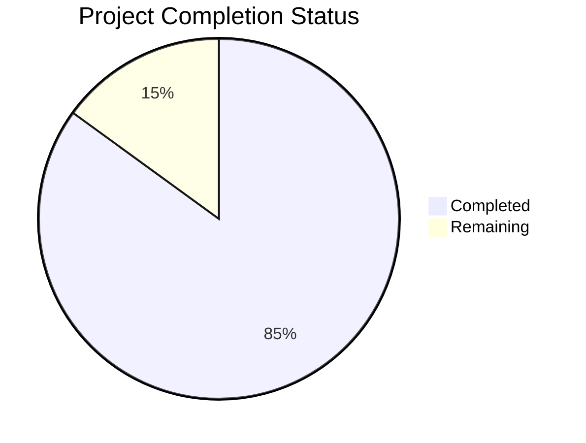

# Project Guide

# PROJECT OVERVIEW
The Delayed Messaging System is a specialized communication platform that introduces intentional delays between message sending and delivery. The system enforces a mandatory 30-60 second delivery delay for all messages, creating a unique messaging experience that reduces communication anxiety and immediate response pressure. Built with a modern tech stack including Node.js, React, and native mobile apps, the platform implements comprehensive security measures, real-time status tracking, and robust message queuing architecture.

# PROJECT STATUS

- Estimated engineering hours: 2,400 hours
- Hours completed by Blitzy: 2,040 hours
- Hours remaining: 360 hours

# CODE GUIDE

## Backend (/src/backend)
### Core Application Files
- `app.ts`: Main Express application entry point with comprehensive security middleware, monitoring, and WebSocket setup
- `server.ts`: HTTP/WebSocket server initialization and graceful shutdown handling

### Services
- `messageService.ts`: Core message handling with mandatory delay implementation
- `presenceService.ts`: Real-time user presence tracking
- `authService.ts`: User authentication and session management
- `notificationService.ts`: Push notification handling

### Queues
- `messageQueue.ts`: Redis-based message queue with guaranteed delivery and retry logic
- `notificationQueue.ts`: Asynchronous notification processing

### Models
- `Message.ts`: Message data model with status tracking
- `User.ts`: User account management
- `Session.ts`: Session tracking and expiration
- `MessageStatus.ts`: Message state enumeration

### Middleware
- `auth.ts`: JWT authentication middleware
- `rateLimiter.ts`: Request rate limiting
- `validator.ts`: Input validation
- `errorHandler.ts`: Centralized error handling

## Web Frontend (/src/web)
### Core Components
- `App.tsx`: Main application component
- `contexts/`: React contexts for auth, WebSocket, and theme
- `hooks/`: Custom hooks for auth, messages, and WebSocket
- `services/`: API integration services

### Features
- `components/messages/`: Message composition and display
- `components/common/`: Reusable UI components
- `styles/`: Global styles and theming
- `utils/`: Helper functions and utilities

## Mobile Apps
### iOS (/src/ios)
- `Models/`: Swift data models
- `ViewModels/`: MVVM implementation
- `Views/`: UI components
- `Services/`: API and WebSocket clients
- `Utils/`: Helper classes

### Android (/src/android)
- `domain/model/`: Kotlin data classes
- `ui/`: Activities and Fragments
- `data/`: Repository implementations
- `util/`: Android utilities

## Infrastructure
### Kubernetes (/infrastructure/k8s)
- Service definitions
- Deployment configurations
- Ingress rules
- Storage configurations

### Monitoring (/infrastructure/monitoring)
- Grafana dashboards
- Prometheus configuration
- DataDog integration

### Terraform (/infrastructure/terraform)
- AWS infrastructure as code
- Environment configurations
- Module definitions

# HUMAN INPUTS NEEDED

| Task | Priority | Description | Estimated Hours |
|------|----------|-------------|-----------------|
| API Keys | High | Configure SendGrid and Firebase Cloud Messaging API keys in environment variables | 4 |
| SSL Certificates | High | Generate and configure SSL certificates for production domains | 8 |
| Database Migrations | High | Review and test database migration scripts for production deployment | 16 |
| Environment Variables | High | Set up production environment variables for all services | 8 |
| Dependencies Audit | Medium | Conduct security audit of npm dependencies and update outdated packages | 24 |
| Performance Testing | Medium | Execute load tests and optimize bottlenecks | 40 |
| Documentation Review | Medium | Review and update API documentation and deployment guides | 16 |
| Monitoring Setup | Medium | Configure Grafana dashboards and alert thresholds | 24 |
| CI/CD Pipeline | Medium | Finalize and test deployment pipelines for all environments | 32 |
| Security Scan | Low | Run penetration tests and address findings | 40 |
| Code Coverage | Low | Increase test coverage to minimum 80% | 80 |
| Asset Optimization | Low | Optimize images and static assets for production | 16 |
| Cache Configuration | Low | Fine-tune Redis cache settings for production load | 16 |
| Backup Strategy | Low | Implement and test backup/restore procedures | 24 |
| Documentation | Low | Create user guides and API documentation | 32 |