# Technical Specifications

# 1. INTRODUCTION

## 1.1 EXECUTIVE SUMMARY

The Delayed Messaging System is a specialized communication platform designed to introduce intentional delays between message sending and delivery. This system addresses the growing need for more mindful digital communication by implementing a mandatory 30-60 second delivery delay for all messages. The platform targets users seeking relief from the immediate response pressure of conventional messaging apps while maintaining secure and reliable communication channels.

Primary stakeholders include end users seeking alternative messaging paradigms, system administrators managing the platform, and business stakeholders interested in user engagement metrics. The system's value proposition centers on reducing communication anxiety while creating a unique messaging experience that differentiates itself in the crowded instant messaging market.

## 1.2 SYSTEM OVERVIEW

### Project Context

| Aspect | Description |
|--------|-------------|
| Market Position | First-to-market delayed messaging platform in the personal communication space |
| Target Market | Individual users seeking mindful communication alternatives |
| Competitive Advantage | Unique delay mechanism creating anticipation and reducing response pressure |
| Enterprise Integration | Standalone system with potential for future enterprise messaging integration |

### High-Level Description

The system implements a message queuing architecture with the following core components:

- User authentication service with username/password credentials
- Message composition and delivery system with enforced delays
- Real-time status tracking and notification system
- Persistent message storage with encryption
- WebSocket-based presence monitoring

Key architectural decisions include:
- Node.js backend for scalable message processing
- Redis-based message queue for delay management
- PostgreSQL for persistent data storage
- WebSocket protocol for real-time status updates

### Success Criteria

| Metric | Target |
|--------|--------|
| Message Delivery Success Rate | 99.99% |
| System Uptime | 99.9% |
| Maximum Concurrent Users | 10,000 |
| Message Processing Latency | < 100ms |
| User Retention Rate | > 70% after 30 days |
| Message Delivery Time Accuracy | ±1 second of intended delay |

## 1.3 SCOPE

### In-Scope Elements

Core Features:
- User registration and authentication
- Text message composition and sending
- 30-60 second delivery delay mechanism
- Message status tracking
- Real-time delivery notifications
- User presence indicators
- Message history and storage

Implementation Boundaries:
- Mobile applications (iOS, Android)
- Web application interface
- REST API for client-server communication
- WebSocket for real-time updates
- Data encryption at rest and in transit

### Out-of-Scope Elements

- Voice messaging capabilities
- Video messaging
- File attachments
- Group messaging functionality
- Message editing after sending
- Message recall functionality
- End-to-end encryption
- Cross-platform message synchronization
- Integration with third-party messaging platforms
- Custom delay duration settings
- Offline message composition
- Message forwarding functionality

# 2. SYSTEM ARCHITECTURE

## 2.1 High-Level Architecture

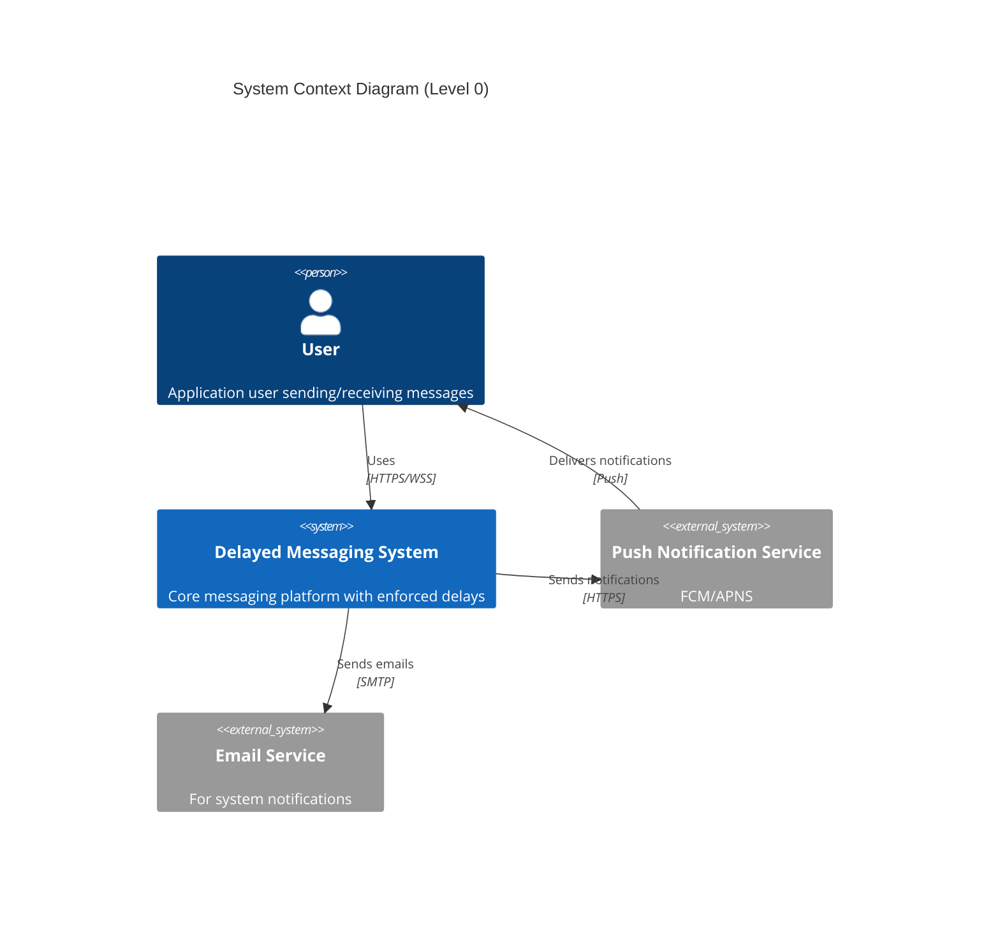

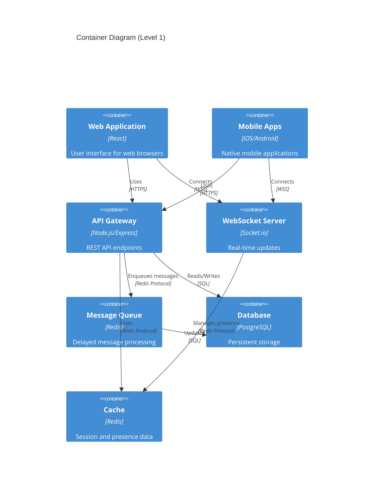

## 2.2 Component Details

### 2.2.1 Core Components

| Component | Purpose | Technology | Scaling Strategy |
|-----------|---------|------------|------------------|
| API Gateway | Request handling and routing | Node.js/Express | Horizontal with load balancer |
| Message Queue | Delay management | Redis | Redis Cluster |
| Database | Persistent storage | PostgreSQL | Primary-replica with sharding |
| WebSocket Server | Real-time updates | Socket.io | Horizontal with sticky sessions |
| Cache Layer | Session/presence management | Redis | Redis Cluster |

### 2.2.2 Component Interactions

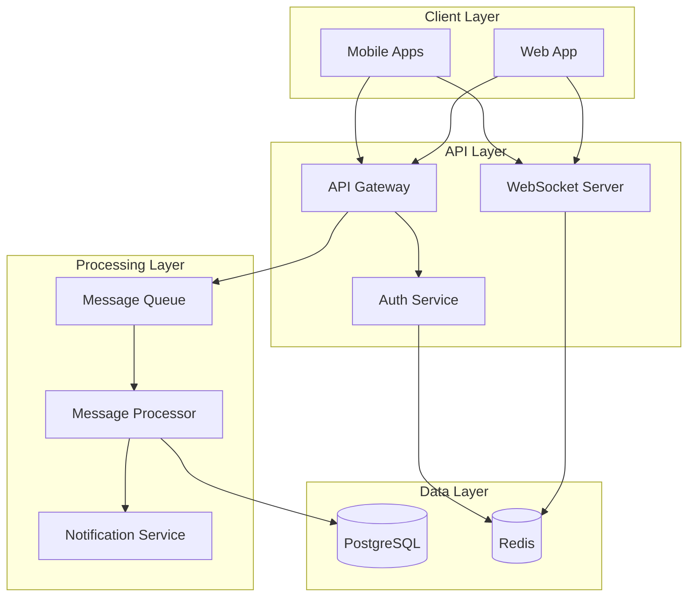

## 2.3 Technical Decisions

### 2.3.1 Architecture Patterns

| Pattern | Justification |
|---------|---------------|
| Layered Architecture | Clear separation of concerns and maintainability |
| Event-Driven | Efficient handling of message delays and notifications |
| Cache-Aside | Improved performance for frequent data access |
| CQRS | Separate read/write paths for message operations |

### 2.3.2 Data Storage Strategy

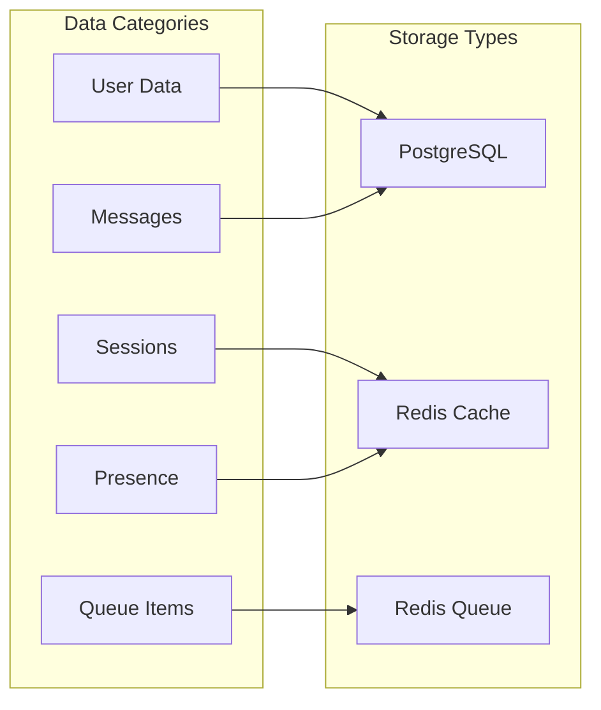

## 2.4 Cross-Cutting Concerns

### 2.4.1 System Monitoring

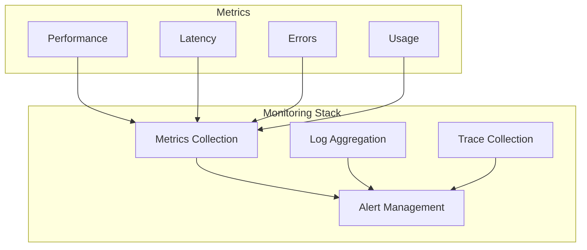

### 2.4.2 Deployment Architecture

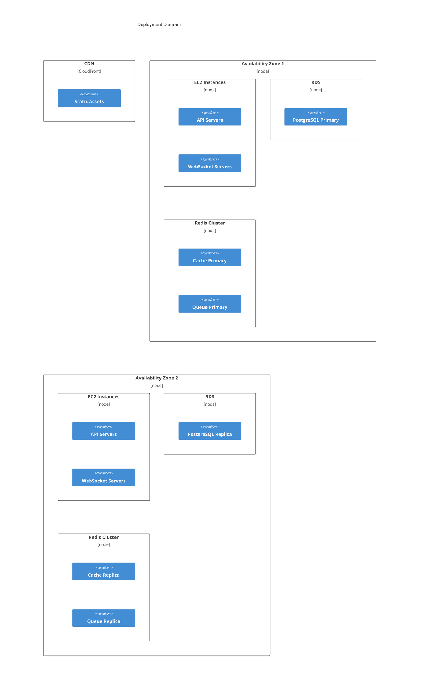

## 2.5 Security Architecture

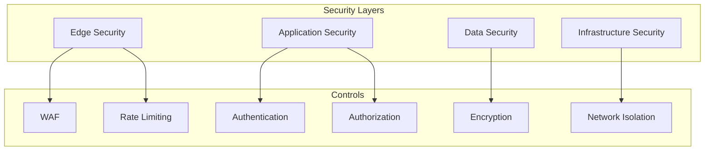

# 3. SYSTEM COMPONENTS ARCHITECTURE

## 3.1 USER INTERFACE DESIGN

### 3.1.1 Design Specifications

| Aspect | Requirement |
|--------|-------------|
| Visual Hierarchy | Primary actions (send) prominent, secondary actions (settings) subdued |
| Component Library | Material Design 3 for Android, Human Interface for iOS |
| Responsive Design | Support 320dp to 1200dp screen widths |
| Accessibility | WCAG 2.1 Level AA compliance |
| Dark/Light Mode | System-level theme detection with manual override |
| Internationalization | LTR layout initially, strings externalized for future localization |

### 3.1.2 Interface Elements

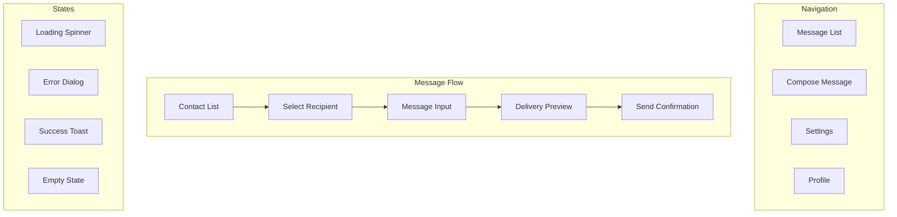

### 3.1.3 Critical User Flows

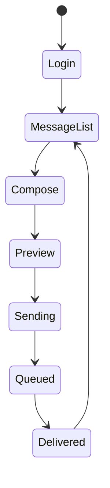

## 3.2 DATABASE DESIGN

### 3.2.1 Schema Design

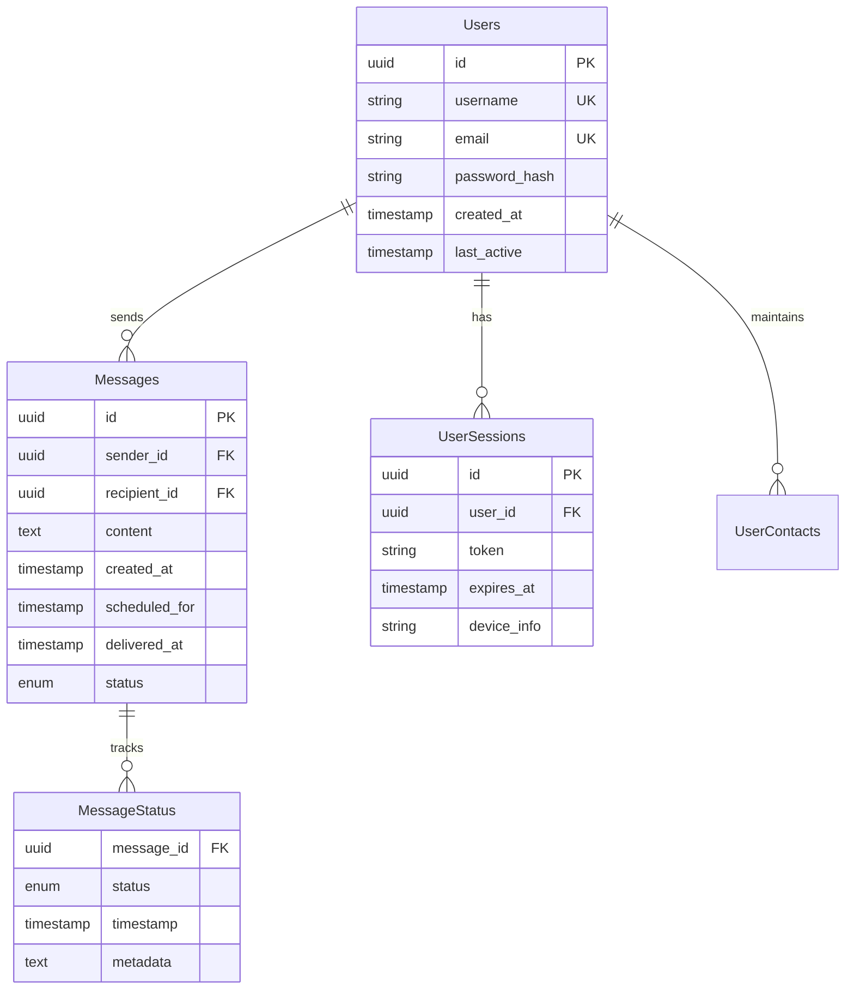

### 3.2.2 Data Management Strategy

| Aspect | Implementation |
|--------|----------------|
| Partitioning | Message table partitioned by month |
| Indexing | B-tree indexes on user_id, created_at, status |
| Archival | Messages older than 30 days moved to cold storage |
| Backup | Hourly incrementals, daily full backups |
| Encryption | AES-256 for data at rest |

## 3.3 API DESIGN

### 3.3.1 API Architecture

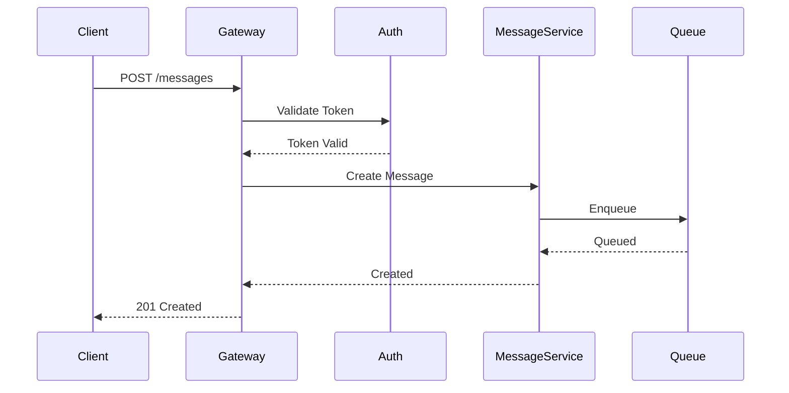

### 3.3.2 Interface Specifications

| Endpoint | Method | Purpose | Auth Required |
|----------|--------|---------|---------------|
| /auth/login | POST | User authentication | No |
| /messages | POST | Send message | Yes |
| /messages | GET | List messages | Yes |
| /messages/{id} | GET | Get message | Yes |
| /users/presence | GET | User status | Yes |

### 3.3.3 Request/Response Format

```json
{
  "message": {
    "id": "uuid",
    "recipient": "username",
    "content": "string(1000)",
    "scheduledDelivery": "ISO8601",
    "status": "enum(QUEUED|SENDING|DELIVERED)"
  }
}
```

### 3.3.4 Integration Requirements

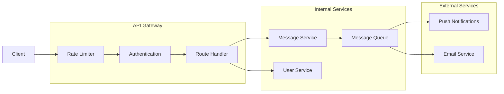

# 4. TECHNOLOGY STACK

## 4.1 PROGRAMMING LANGUAGES

| Platform/Component | Language | Version | Justification |
|-------------------|----------|---------|---------------|
| Backend Services | Node.js | 18.x LTS | Event-driven architecture support, extensive package ecosystem, optimal for real-time WebSocket handling |
| iOS Client | Swift | 5.x | Native performance, modern syntax, strong type safety |
| Android Client | Kotlin | 1.8.x | Official Android language, Java interoperability, coroutines for async operations |
| Web Client | TypeScript | 4.9.x | Type safety, enhanced IDE support, improved maintainability |
| Database Scripts | SQL | PostgreSQL 14 | ACID compliance, robust querying capabilities |

## 4.2 FRAMEWORKS & LIBRARIES

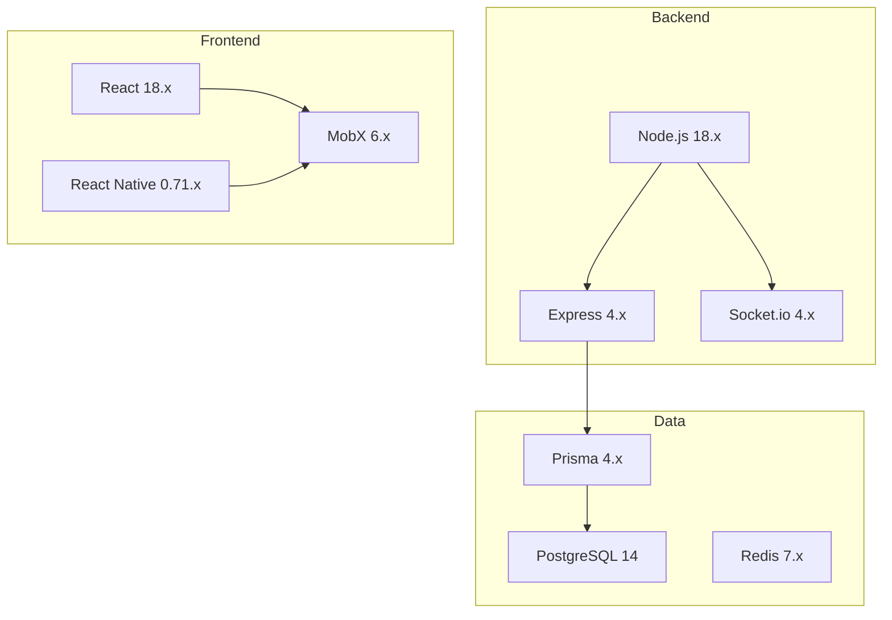

### Core Frameworks

| Component | Framework | Version | Purpose |
|-----------|-----------|---------|----------|
| Backend API | Express | 4.x | RESTful API implementation, middleware support |
| Real-time Communication | Socket.io | 4.x | WebSocket handling, presence management |
| Web Frontend | React | 18.x | Component-based UI, virtual DOM efficiency |
| Mobile Apps | React Native | 0.71.x | Cross-platform mobile development |
| State Management | MobX | 6.x | Reactive state management |
| ORM | Prisma | 4.x | Type-safe database access |

## 4.3 DATABASES & STORAGE

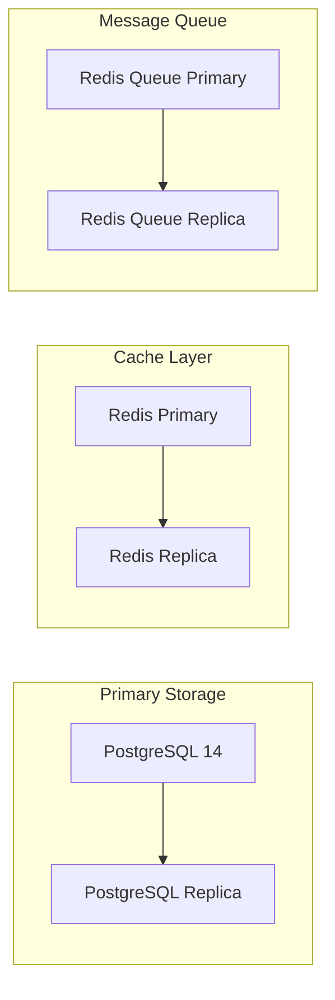

| Component | Technology | Version | Purpose |
|-----------|------------|---------|----------|
| Primary Database | PostgreSQL | 14.x | User data, messages, relationships |
| Message Queue | Redis | 7.x | Message delay implementation |
| Cache Layer | Redis | 7.x | Session management, presence data |
| Object Storage | AWS S3 | - | Media and backup storage |

## 4.4 THIRD-PARTY SERVICES

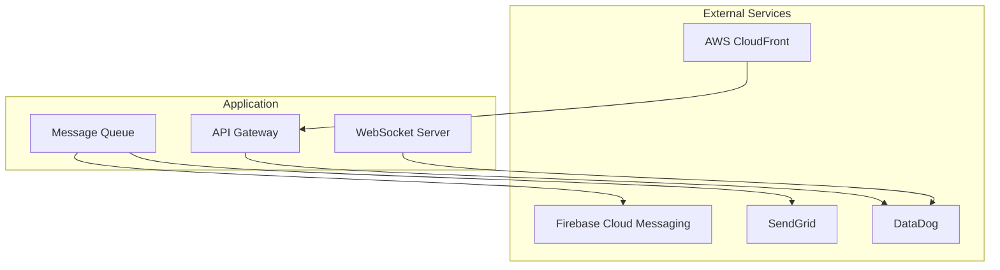

| Service | Purpose | Integration Method |
|---------|---------|-------------------|
| AWS CloudFront | CDN, DDoS protection | Direct integration |
| Firebase Cloud Messaging | Push notifications | SDK integration |
| SendGrid | Transactional emails | REST API |
| DataDog | Monitoring and APM | Agent-based |
| AWS CloudWatch | Log aggregation | SDK integration |

## 4.5 DEVELOPMENT & DEPLOYMENT

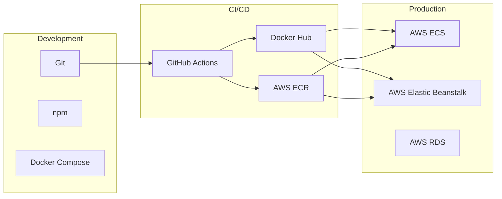

### Development Tools

| Category | Tool | Version | Purpose |
|----------|------|---------|----------|
| Version Control | Git | 2.x | Source code management |
| Package Management | npm | 8.x | Dependency management |
| Local Development | Docker Compose | 2.x | Service orchestration |
| Code Quality | ESLint | 8.x | Static code analysis |
| Testing | Jest | 29.x | Unit and integration testing |

### Deployment Pipeline

| Stage | Technology | Purpose |
|-------|------------|----------|
| Build | GitHub Actions | CI/CD automation |
| Containerization | Docker | Application packaging |
| Registry | AWS ECR | Container image storage |
| Orchestration | AWS ECS | Container orchestration |
| Load Balancing | AWS ALB | Traffic distribution |
| SSL/TLS | AWS ACM | Certificate management |

## 5. SYSTEM DESIGN

### 5.1 User Interface Design

#### 5.1.1 Mobile Application Layout

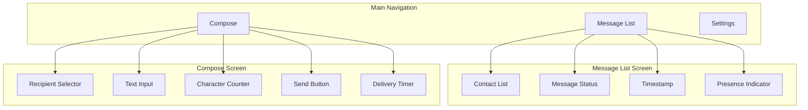

#### 5.1.2 Screen Components

| Screen | Component | Description | Interaction |
|--------|-----------|-------------|-------------|
| Message List | Contact List | Scrollable list with user avatars and names | Tap to select recipient |
| Message List | Status Indicators | Icons showing message states | Non-interactive |
| Compose | Text Input | Multi-line text field with 1000 char limit | Direct text entry |
| Compose | Send Button | Primary action button | Tap to send with confirmation |
| Compose | Delivery Timer | Shows estimated delivery window | Updates in real-time |

### 5.2 Database Design

#### 5.2.1 Schema Structure

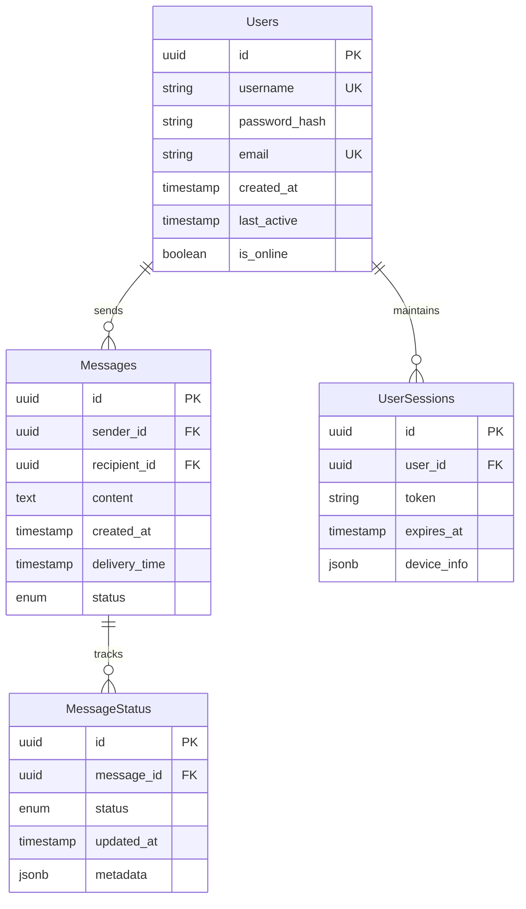

#### 5.2.2 Data Storage Strategy

| Data Type | Storage Solution | Justification |
|-----------|-----------------|---------------|
| User Data | PostgreSQL | ACID compliance, relational integrity |
| Messages | PostgreSQL | Transaction support, complex queries |
| Sessions | Redis | Fast access, automatic expiration |
| Message Queue | Redis | High-performance queue operations |
| Presence Data | Redis | Real-time updates, pub/sub support |

### 5.3 API Design

#### 5.3.1 REST Endpoints

| Endpoint | Method | Purpose | Request Body | Response |
|----------|--------|---------|--------------|-----------|
| /auth/login | POST | User authentication | {username, password} | {token, user} |
| /messages | POST | Send message | {recipient_id, content} | {message_id, status} |
| /messages | GET | List messages | - | [{message}] |
| /messages/:id | GET | Get message details | - | {message} |
| /users/presence | GET | Get online status | - | {status} |

#### 5.3.2 WebSocket Events

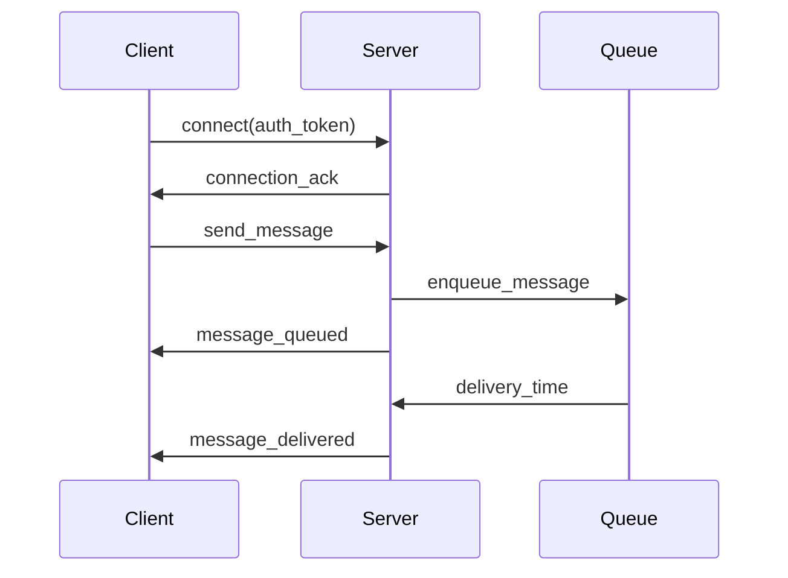

#### 5.3.3 Message Flow Architecture

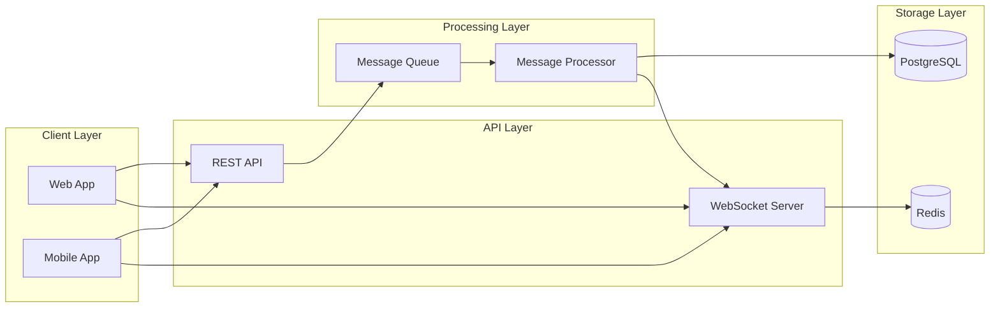

### 5.4 Security Design

#### 5.4.1 Authentication Flow

```mermaid
sequenceDiagram
    participant User
    participant API
    participant Auth
    participant DB
    
    User->>API: Login Request
    API->>Auth: Validate Credentials
    Auth->>DB: Check User
    DB->>Auth: User Data
    Auth->>API: Generate JWT
    API->>User: Return Token
```

#### 5.4.2 Security Controls

| Layer | Control | Implementation |
|-------|---------|----------------|
| Transport | TLS 1.3 | All API and WebSocket connections |
| Authentication | JWT | Token-based session management |
| Authorization | RBAC | Role-based access control |
| Data | AES-256 | Message content encryption |
| API | Rate Limiting | 100 requests per minute |
| Infrastructure | WAF | AWS WAF with custom rules |

## 6. USER INTERFACE DESIGN

### 6.1 Common Elements

```
+------------------+
| HEADER ELEMENTS  |
+------------------+
[@] User Profile   
[#] Main Menu      
[=] Settings       
[!] Notifications  
[?] Help/Support   
```

### 6.2 Login Screen

```
+----------------------------------------+
|           Delayed Messaging            |
+----------------------------------------+
|                                        |
|            [@] Login                   |
|                                        |
|  Username: [.....................]     |
|                                        |
|  Password: [.....................]     |
|                                        |
|  [    Sign In    ]  [  Register  ]    |
|                                        |
|  [?] Forgot Password?                  |
|                                        |
+----------------------------------------+
```

### 6.3 Main Message List

```
+----------------------------------------+
| [@] Profile    [#] Menu    [!] Alerts  |
+----------------------------------------+
| [Search Contacts............]          |
|----------------------------------------|
| CONVERSATIONS                          |
|----------------------------------------|
| [@] Alice Smith                    [>] |
| Last message: Hey there!              |
| Status: Delivered • 5m ago            |
|----------------------------------------|
| [@] Bob Jones                      [>] |
| Last message: See you tomorrow!       |
| Status: Pending • 30s remaining       |
|----------------------------------------|
| [@] Carol White                    [>] |
| Last message: Thanks!                 |
| Status: Sent • 45s remaining         |
+----------------------------------------+
| [+] New Message                        |
+----------------------------------------+
```

### 6.4 Message Composition

```
+----------------------------------------+
| [<] Back    To: [v] Select Contact     |
+----------------------------------------+
|                                        |
|  +----------------------------------+  |
|  |                                  |  |
|  |     Message composition area     |  |
|  |                                  |  |
|  +----------------------------------+  |
|                                        |
| Characters: 0/1000                     |
|                                        |
| Estimated Delivery: 30-60 seconds      |
|                                        |
| [      Send Message      ]             |
+----------------------------------------+
```

### 6.5 Message Status View

```
+----------------------------------------+
| Message Details                        |
+----------------------------------------+
| To: [@] Alice Smith                    |
| Sent: 2024-02-20 14:30:25             |
|----------------------------------------|
| Status Timeline:                       |
|                                        |
| [*] Composed   • 14:30:25             |
| [*] Sent      • 14:30:26             |
| [*] Queued    • 14:30:27             |
| [=====----------------] 30s remaining  |
| [ ] Delivered                          |
+----------------------------------------+
```

### 6.6 Settings Panel

```
+----------------------------------------+
| [<] Back         Settings              |
+----------------------------------------+
| Account                                |
| ( ) Online                            |
| ( ) Away                              |
| ( ) Do Not Disturb                    |
|----------------------------------------|
| Notifications                          |
| [x] Message Delivery                   |
| [x] New Messages                       |
| [ ] Status Updates                     |
|----------------------------------------|
| Theme                                  |
| ( ) Light                             |
| ( ) Dark                              |
| ( ) System Default                     |
+----------------------------------------+
```

### 6.7 Component Key

```
ICONS:
[@] - User/Profile icon
[#] - Menu/Dashboard
[=] - Settings
[!] - Alerts/Notifications
[?] - Help
[+] - Add/Create new
[<] - Back/Previous
[>] - Forward/Next
[*] - Completed/Success
[x] - Close/Delete

INPUTS:
[...] - Text input field
[v] - Dropdown menu
( ) - Radio button
[x] - Checkbox (checked)
[ ] - Checkbox (unchecked)
[====] - Progress bar

CONTAINERS:
+--+ - Container border
|  | - Container walls
--- - Separator line
```

### 6.8 Responsive Breakpoints

| Breakpoint | Width (px) | Layout Changes |
|------------|------------|----------------|
| Mobile | 320-480 | Single column, stacked elements |
| Tablet | 481-768 | Two column messages list |
| Desktop | 769+ | Three column with sidebar |

### 6.9 Color Scheme

```
Primary Actions:    #2196F3 (Material Blue)
Secondary Actions: #757575 (Gray)
Success States:    #4CAF50 (Green)
Warning States:    #FFC107 (Amber)
Error States:      #F44336 (Red)
Background:        #FFFFFF (Light) / #121212 (Dark)
Text:              #000000 (Light) / #FFFFFF (Dark)
```

### 6.10 Typography

```
Headers:     Roboto Bold, 16-24px
Body Text:   Roboto Regular, 14px
Labels:      Roboto Medium, 12px
Timestamps:  Roboto Light, 10px
```

All UI elements follow Material Design 3 guidelines for Android and Human Interface Guidelines for iOS, maintaining platform-specific patterns while keeping core functionality consistent across platforms.

## 7. SECURITY CONSIDERATIONS

### 7.1 AUTHENTICATION AND AUTHORIZATION

```mermaid
flowchart TD
    A[User Login Request] --> B{Validate Credentials}
    B -->|Invalid| C[Return Error]
    B -->|Valid| D[Generate JWT]
    D --> E[Set Session Cache]
    E --> F[Return Token]
    
    G[Protected Request] --> H{Validate Token}
    H -->|Invalid| I[Return 401]
    H -->|Valid| J{Check Permissions}
    J -->|Denied| K[Return 403]
    J -->|Granted| L[Process Request]
```

#### Authentication Flow

| Stage | Implementation | Details |
|-------|---------------|----------|
| Login | Username/Password | Argon2 password hashing, rate limiting |
| Session | JWT Tokens | 24-hour expiry, refresh token rotation |
| MFA | Not implemented | Planned for future release |
| Password Policy | Enforced | Min 8 chars, 1 uppercase, 1 number |
| Session Management | Redis Cache | Distributed session tracking |

#### Authorization Matrix

| Role | Message Send | Message Read | Contact Management | Profile Management |
|------|--------------|--------------|-------------------|-------------------|
| User | Yes | Own Messages | Own Contacts | Own Profile |
| Admin | No | All Messages | No | All Profiles |
| System | Yes | All Messages | No | No |

### 7.2 DATA SECURITY

```mermaid
flowchart LR
    subgraph Data at Rest
        A[User Data] --> B[AES-256]
        C[Messages] --> D[AES-256]
        E[Credentials] --> F[Argon2]
    end
    
    subgraph Data in Transit
        G[API Calls] --> H[TLS 1.3]
        I[WebSocket] --> J[WSS]
        K[Database] --> L[TLS 1.3]
    end
```

#### Encryption Standards

| Data Type | Encryption Method | Key Management |
|-----------|------------------|----------------|
| Messages | AES-256-GCM | AWS KMS |
| User Data | AES-256-CBC | AWS KMS |
| Passwords | Argon2id | Salt per password |
| Sessions | AES-256-GCM | Rotating keys |

#### Data Protection Measures

| Protection Layer | Implementation | Purpose |
|-----------------|----------------|----------|
| Application | Input validation | Prevent injection attacks |
| Transport | TLS 1.3 | Secure data transmission |
| Database | Row-level encryption | Data privacy |
| File System | Volume encryption | Physical security |

### 7.3 SECURITY PROTOCOLS

```mermaid
flowchart TD
    subgraph Prevention
        A[WAF] --> B[Rate Limiting]
        B --> C[Input Validation]
        C --> D[Authentication]
    end
    
    subgraph Detection
        E[Logging] --> F[Monitoring]
        F --> G[Alerting]
        G --> H[Incident Response]
    end
    
    subgraph Response
        I[Block Attack] --> J[Analyze Incident]
        J --> K[Update Security]
        K --> L[Document Changes]
    end
```

#### Security Controls

| Control Type | Implementation | Update Frequency |
|--------------|----------------|------------------|
| WAF Rules | AWS WAF | Weekly |
| Rate Limiting | Express Rate Limit | Real-time |
| IP Blocking | Fail2Ban | Real-time |
| Vulnerability Scanning | SonarQube | Daily |
| Dependency Scanning | npm audit | On deployment |

#### Security Monitoring

| Aspect | Tool | Alert Threshold |
|--------|------|----------------|
| Failed Logins | CloudWatch | >5 per minute |
| API Rate | DataDog | >100 req/min |
| System Access | AWS CloudTrail | Any root access |
| Data Access | PostgreSQL Audit | Any unauthorized attempt |

#### Incident Response Protocol

```mermaid
stateDiagram-v2
    [*] --> Detection
    Detection --> Analysis
    Analysis --> Containment
    Containment --> Eradication
    Eradication --> Recovery
    Recovery --> PostIncident
    PostIncident --> [*]
```

| Phase | Actions | Responsible Team |
|-------|---------|-----------------|
| Detection | Log analysis, Alert verification | Security Ops |
| Analysis | Threat assessment, Impact evaluation | Security Team |
| Containment | Block attack, Isolate systems | DevOps |
| Eradication | Remove threat, Patch vulnerabilities | Development |
| Recovery | Restore services, Verify security | DevOps |
| Post-Incident | Document lessons, Update procedures | Security Team |

## 8. INFRASTRUCTURE

### 8.1 DEPLOYMENT ENVIRONMENT

```mermaid
flowchart TD
    subgraph Production Environment
        AWS[AWS Cloud]
        AZ1[Availability Zone 1]
        AZ2[Availability Zone 2]
    end
    
    subgraph Staging Environment
        STGAZ[Staging AZ]
    end
    
    subgraph Development Environment
        DEV[Local Development]
        TEST[Testing Environment]
    end
    
    DEV --> TEST
    TEST --> STGAZ
    STGAZ --> AZ1 & AZ2
```

| Environment | Purpose | Infrastructure |
|-------------|---------|----------------|
| Development | Local development and testing | Docker Compose, Local PostgreSQL/Redis |
| Testing | Automated testing and QA | AWS ECS Single Instance |
| Staging | Pre-production verification | AWS ECS Cluster (Single AZ) |
| Production | Live system | AWS ECS Cluster (Multi-AZ) |

### 8.2 CLOUD SERVICES

| Service | Purpose | Justification |
|---------|---------|---------------|
| AWS ECS | Container orchestration | Native AWS integration, cost-effective for our scale |
| AWS RDS | PostgreSQL database | Managed service with automatic failover |
| AWS ElastiCache | Redis for queue/cache | Managed Redis with cluster mode |
| AWS CloudFront | CDN | Global content delivery, DDoS protection |
| AWS Route 53 | DNS management | High availability DNS with health checks |
| AWS ACM | SSL certificates | Automated certificate management |
| AWS CloudWatch | Monitoring and logging | Integrated monitoring solution |
| AWS WAF | Web application firewall | Protection against common web exploits |

### 8.3 CONTAINERIZATION

```mermaid
flowchart LR
    subgraph Container Architecture
        API[API Container]
        WS[WebSocket Container]
        WORKER[Message Worker]
    end
    
    subgraph Base Images
        NODE[Node 18 Alpine]
        NGINX[NGINX Alpine]
    end
    
    NODE --> API & WS & WORKER
    NGINX --> API
```

#### Docker Configuration

| Component | Base Image | Exposed Ports | Resource Limits |
|-----------|------------|---------------|-----------------|
| API Server | node:18-alpine | 3000 | 512MB RAM, 0.5 CPU |
| WebSocket | node:18-alpine | 3001 | 512MB RAM, 0.5 CPU |
| Message Worker | node:18-alpine | N/A | 256MB RAM, 0.25 CPU |
| NGINX | nginx:alpine | 80, 443 | 128MB RAM, 0.25 CPU |

### 8.4 ORCHESTRATION

```mermaid
flowchart TD
    subgraph ECS Cluster
        SG1[Service Group 1]
        SG2[Service Group 2]
    end
    
    subgraph Service Group 1
        API1[API Tasks]
        WS1[WebSocket Tasks]
    end
    
    subgraph Service Group 2
        W1[Worker Tasks]
        W2[Worker Tasks]
    end
    
    ALB[Application Load Balancer] --> API1
    ALB --> WS1
    SQS[AWS SQS] --> W1 & W2
```

#### ECS Service Configuration

| Service | Tasks | Auto-scaling Rules | Health Check |
|---------|-------|-------------------|--------------|
| API | 2-10 | CPU > 70%, Memory > 80% | HTTP 200 on /health |
| WebSocket | 2-8 | Connection count > 1000 | TCP on port 3001 |
| Worker | 2-6 | Queue length > 1000 | Process heartbeat |

### 8.5 CI/CD PIPELINE

```mermaid
flowchart LR
    subgraph Development
        GIT[GitHub]
        ACTION[GitHub Actions]
    end
    
    subgraph Build
        TEST[Run Tests]
        LINT[Code Linting]
        BUILD[Build Images]
        SCAN[Security Scan]
    end
    
    subgraph Deploy
        ECR[Push to ECR]
        ECS[Deploy to ECS]
        VERIFY[Health Check]
    end
    
    GIT --> ACTION
    ACTION --> TEST & LINT
    TEST & LINT --> BUILD
    BUILD --> SCAN
    SCAN --> ECR
    ECR --> ECS
    ECS --> VERIFY
```

#### Pipeline Stages

| Stage | Actions | Success Criteria |
|-------|---------|-----------------|
| Build | Run tests, lint code | All tests pass, no lint errors |
| Security | SonarQube scan, npm audit | No critical vulnerabilities |
| Package | Build Docker images | Successful build and tag |
| Push | Push to ECR | Image pushed to registry |
| Deploy | Update ECS services | Health checks pass |
| Verify | Run smoke tests | API endpoints responsive |

#### Deployment Strategy

| Environment | Strategy | Rollback Plan |
|-------------|----------|---------------|
| Staging | Blue/Green | Automatic on health check failure |
| Production | Rolling update | Manual verification, automated rollback |
| Database | Zero-downtime migration | Automated backup before migration |

# 9. APPENDICES

## 9.1 ADDITIONAL TECHNICAL INFORMATION

### Message Queue Implementation Details

```mermaid
flowchart TD
    subgraph Queue Processing
        A[Message Received] --> B{Validate Message}
        B -->|Valid| C[Add to Redis Queue]
        B -->|Invalid| D[Return Error]
        C --> E[Calculate Delay]
        E --> F[Schedule Delivery]
        F --> G[Process at Time]
        G --> H{Recipient Online?}
        H -->|Yes| I[Deliver]
        H -->|No| J[Store in Secondary Queue]
    end
```

### Database Sharding Strategy

| Shard Key | Data Distribution | Replication Factor |
|-----------|------------------|-------------------|
| User ID | Hash-based | 3 replicas |
| Message Timestamp | Range-based | 2 replicas |
| Geographic Region | List-based | 2 replicas |

### Backup Rotation Schedule

| Backup Type | Retention | Storage Location |
|-------------|-----------|------------------|
| Hourly | 24 hours | Primary Region |
| Daily | 7 days | Cross-Region |
| Weekly | 1 month | Cold Storage |
| Monthly | 1 year | Archive |

## 9.2 GLOSSARY

| Term | Definition |
|------|------------|
| Blue/Green Deployment | A deployment strategy using two identical environments for zero-downtime updates |
| Cold Storage | Low-cost storage for infrequently accessed data |
| Dark Mode | User interface color scheme optimized for low-light environments |
| Health Check | Automated system status verification |
| Hot Standby | A backup system ready to take over immediately |
| Message Queue | System for handling asynchronous message processing |
| Rate Limiting | Controlling the frequency of API requests |
| Rolling Update | Gradual deployment of new versions across servers |
| Sharding | Database partitioning for improved scalability |
| WebSocket | Protocol for full-duplex communication channels |

## 9.3 ACRONYMS

| Acronym | Full Form |
|---------|-----------|
| ACID | Atomicity, Consistency, Isolation, Durability |
| ALB | Application Load Balancer |
| API | Application Programming Interface |
| APM | Application Performance Monitoring |
| AWS | Amazon Web Services |
| CDN | Content Delivery Network |
| CPU | Central Processing Unit |
| CRUD | Create, Read, Update, Delete |
| DDoS | Distributed Denial of Service |
| DNS | Domain Name System |
| ECS | Elastic Container Service |
| ECR | Elastic Container Registry |
| FIFO | First In, First Out |
| GDPR | General Data Protection Regulation |
| HTTP | Hypertext Transfer Protocol |
| HTTPS | Hypertext Transfer Protocol Secure |
| JWT | JSON Web Token |
| RAM | Random Access Memory |
| REST | Representational State Transfer |
| SDK | Software Development Kit |
| SQL | Structured Query Language |
| SSD | Solid State Drive |
| SSL | Secure Sockets Layer |
| TCP | Transmission Control Protocol |
| TLS | Transport Layer Security |
| UI | User Interface |
| UUID | Universally Unique Identifier |
| WAF | Web Application Firewall |
| WCAG | Web Content Accessibility Guidelines |
| WSS | WebSocket Secure |